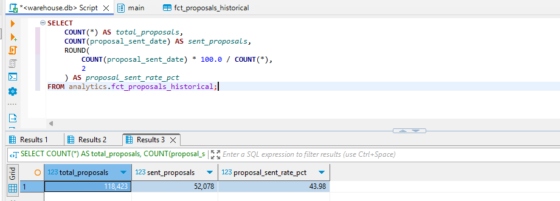
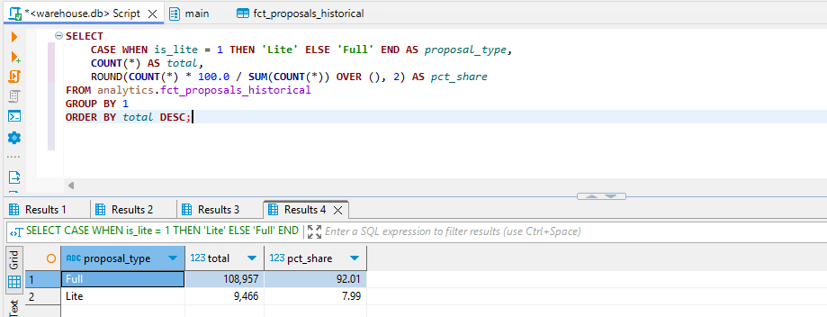
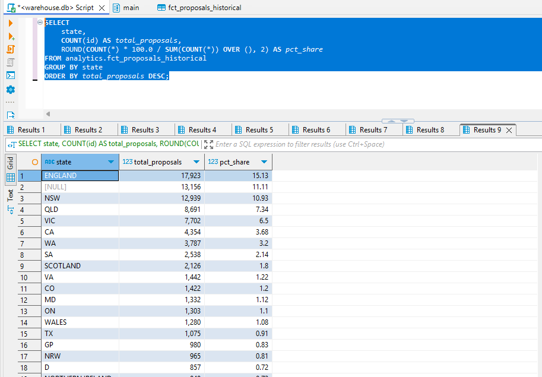
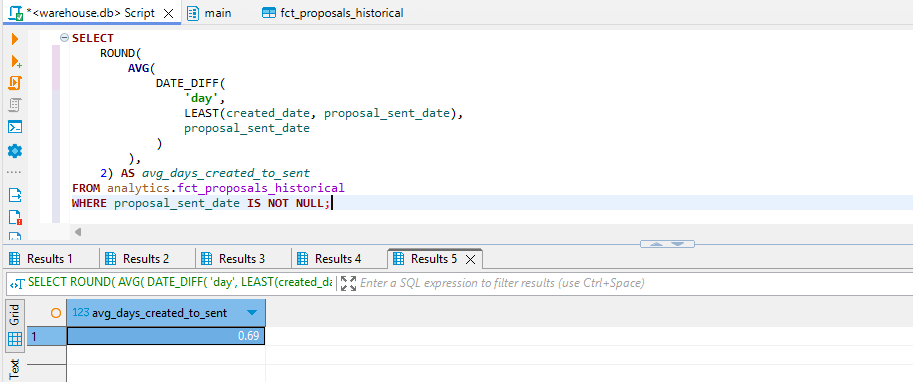

### Metrics

## Proposal Sent Rate

The proposal sent rate is the number of proposals sent over the total number of proposals.

Sent proposals are records which have non-null values for **proposal_sent_date**.
```
SELECT
    COUNT(*) AS total_proposals,
    COUNT(proposal_sent_date) AS sent_proposals,
    ROUND(
        COUNT(proposal_sent_date) * 100.0 / COUNT(*),
        2
    ) AS proposal_sent_rate_pct
FROM analytics.fct_proposals_historical;
```



### Lite vs Full

The number of lite proposals over total number of proposals and full proposals over total number of proposals

```
SELECT
    CASE WHEN is_lite = 1 THEN 'Lite' ELSE 'Full' END AS proposal_type,
    COUNT(*) AS total,
    ROUND(COUNT(*) * 100.0 / SUM(COUNT(*)) OVER (), 2) AS pct_share
FROM analytics.fct_proposals_historical 
GROUP BY 1
ORDER BY total DESC;
```



### Proposals by State

The number of proposals created per state over the total number of proposals

```
SELECT
    state,
    COUNT(id) AS total_proposals,
    ROUND(COUNT(*) * 100.0 / SUM(COUNT(*)) OVER (), 2) AS pct_share
FROM analytics.fct_proposals_historical 
GROUP BY state
ORDER BY total_proposals DESC;
```



### Average Time from Created to Sent

There are cases when created_date is greater than proposal_sent_date. This may mean that a proposal was created and sent outside of the system before being created in the system.

In this case, the diff is zero days.
```
SELECT
    ROUND(
        AVG(
            DATE_DIFF(
                'day',
                LEAST(created_date, proposal_sent_date),
                proposal_sent_date
            )
        ),
    2) AS avg_days_created_to_sent
FROM analytics.fct_proposals_historical 
WHERE proposal_sent_date IS NOT NULL;
```


